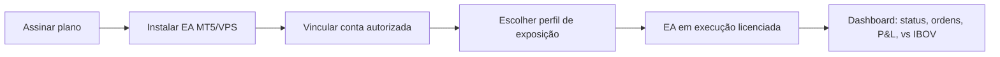
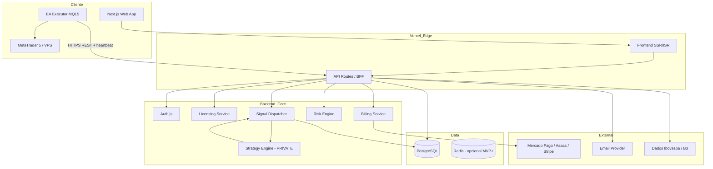
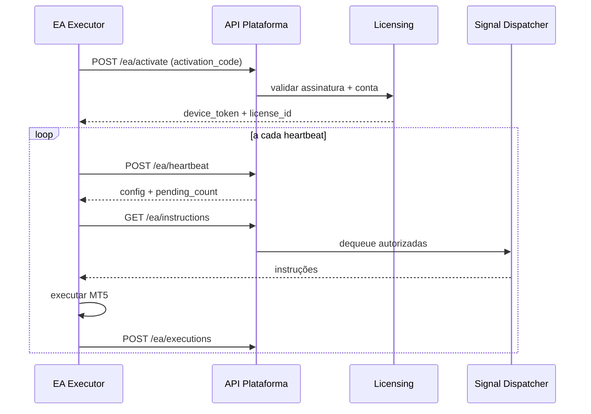
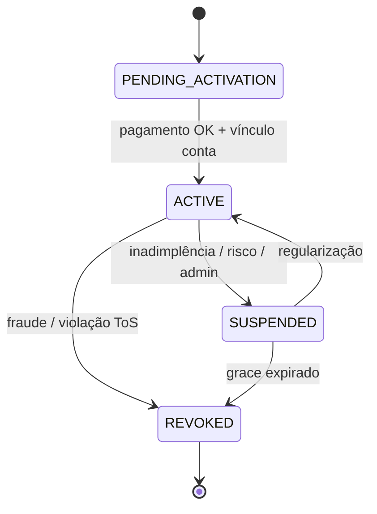
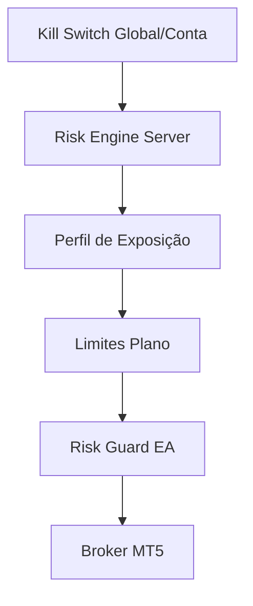
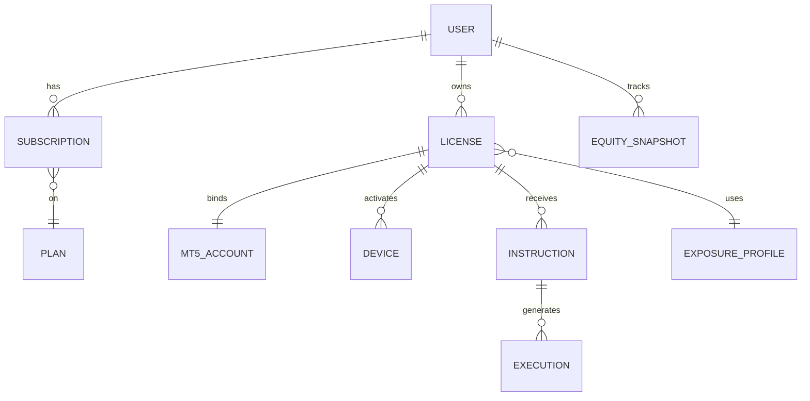

# Documento Mestre do Produto — Mercado da Riqueza AutoTrade

**Arquivo:** `docs/MERCADO_DA_RIQUEZA_AUTOTRADE_MASTER.md`  
**Versão:** 1.1  
**Data:** 20/05/2026  
**Classificação:** Confidencial — estratégia e parâmetros operacionais restritos ao servidor  
**Público:** Fundadores, engenharia, produto, compliance, operações  
**Regras de implementação:** [`AGENTS.md`](../AGENTS.md)

---

## Sumário

1. [Visão geral do produto](#1-visão-geral-do-produto)
2. [Posicionamento comercial](#2-posicionamento-comercial)
3. [Arquitetura técnica](#3-arquitetura-técnica)
4. [Módulos da plataforma](#4-módulos-da-plataforma)
5. [Módulos do EA cliente](#5-módulos-do-ea-cliente)
6. [Servidor de sinais](#6-servidor-de-sinais)
7. [Sistema de licença](#7-sistema-de-licença)
8. [Sistema de cobrança](#8-sistema-de-cobrança)
9. [Banco de dados](#9-banco-de-dados)
10. [APIs necessárias](#10-apis-necessárias)
11. [Travas de risco](#11-travas-de-risco)
12. [Dashboard do cliente](#12-dashboard-do-cliente)
13. [Painel administrativo](#13-painel-administrativo)
14. [Logs e auditoria](#14-logs-e-auditoria)
15. [Segurança](#15-segurança)
16. [Compliance e avisos de risco](#16-compliance-e-avisos-de-risco)
17. [Roadmap MVP](#17-roadmap-mvp)
18. [Roadmap versão profissional](#18-roadmap-versão-profissional)

---

## 1. Visão geral do produto

### 1.1 O que é

**Mercado da Riqueza AutoTrade** é um SaaS de automação para **MetaTrader 5 (MT5)** no mercado brasileiro (B3), em modelo **caixa preta**: toda inteligência operacional — estratégia, parâmetros, filtros, horários, stops, alvos, regras de entrada/saída e gestão de risco — reside **exclusivamente no servidor** do Mercado da Riqueza. O cliente não configura lógica de trading nem tem visibilidade da estratégia.

O cliente recebe um **EA executor licenciado** (MQL5), que apenas:

- autentica e mantém licença ativa;
- sincroniza perfil de exposição permitido pelo plano;
- recebe e executa **ordens/instruções** autorizadas pelo servidor;
- reporta estado da conta, ordens, posições e heartbeat;
- respeita travas de risco impostas pelo servidor e pelo plano.

### 1.1.1 O que o cliente faz (e apenas isso)

1. **Assina um plano** (billing recorrente).
2. **Instala o EA executor** no MetaTrader 5 ou VPS.
3. **Vincula a conta MT5 autorizada** (login, servidor, corretora).
4. **Escolhe um perfil de exposição** permitido pelo plano (sem editar estratégia).
5. **Acompanha no dashboard:** status, ordens, posição, resultado, evolução patrimonial e comparação com **Ibovespa**.

O cliente **não** parametriza o robô, **não** vê lógica de entrada/saída, filtros, horários, alvos, stops ou regras internas.

### 1.2 Proposta de valor

| Para o cliente | Para o negócio |
|----------------|----------------|
| Automação profissional sem necessidade de expertise em estratégia | IP protegida (estratégia não exposta) |
| Onboarding simples: assinar → instalar EA → vincular conta → escolher perfil | Receita recorrente por plano + upsell de perfis/VPS |
| Transparência de **resultado** (não de lógica): P&L, evolução, vs Ibovespa | Controle centralizado de risco e rollout de versões |
| Operação em VPS com monitoramento via dashboard | Auditoria, compliance e kill switch global |

### 1.3 Jornada do cliente (fora da caixa preta)



### 1.4 Princípios inegociáveis

| # | Princípio |
|---|-----------|
| P1 | **Nenhum parâmetro estratégico** exposto ao cliente (UI, API pública, logs do EA, arquivos `.set`). |
| P2 | **Sem tela de setup operacional** para o cliente; apenas perfil de exposição dentro do catálogo do plano. |
| P3 | **EA = executor**, não robô estratégico: sem inputs de estratégia no MT5. |
| P4 | Servidor é **fonte da verdade** para licença, risco, sinais e estado autorizado. |
| P5 | Falha segura: sem licença válida ou heartbeat → **parar execução** e fechar conforme política server-side. |

### 1.5 Atores do sistema

- **Cliente assinante** — usa dashboard e EA.
- **Conta MT5 autorizada** — login/servidor/corretora vinculados à licença.
- **Plataforma web** — auth, billing, dashboard, vínculo de conta.
- **API + Servidor de sinais** — licenciamento, risco, emissão de instruções.
- **Motor de estratégia (interno)** — isolado; não exposto via API pública.
- **Admin / Operações** — painel, auditoria, suporte, kill switch.
- **Provedores externos** — gateway de pagamento, e-mail, SMS (opcional), dados de mercado/índice.

---

## 2. Posicionamento comercial

### 2.1 Segmento

Investidores pessoa física e pequenos escritórios que operam ou desejam operar **ações/derivativos B3 via MT5**, buscando automação gerenciada sem desenvolver ou manter estratégia própria.

### 2.2 Diferenciais

1. **Estratégia proprietária gerenciada** — cliente compra acesso à execução, não ao know-how.
2. **Perfis de exposição** — camada comercial de “quanto arrisco” sem revelar alocação tática.
3. **Dashboard financeiro** — evolução patrimonial e benchmark vs **Ibovespa**.
4. **Compliance explícito** — avisos de risco, natureza de ferramenta tecnológica, não promessa de retorno.

### 2.3 Modelo de receita

| Componente | Descrição |
|------------|-----------|
| Assinatura mensal/anual | Por plano (limites de conta, perfis, suporte) |
| Taxa de ativação (opcional) | Primeiro vínculo / onboarding |
| Add-on VPS (opcional) | Parceiro ou white-label |
| Upgrade de plano | Mais contas, perfil superior, prioridade de suporte |

### 2.4 Planos (estrutura sugerida)

| Plano | Contas MT5 | Perfis disponíveis | Suporte | Observação |
|-------|------------|-------------------|---------|------------|
| Starter | 1 | Conservador | E-mail | Entrada |
| Pro | 1–2 | Conservador, Moderado | Chat | Principal |
| Elite | até 3 | Todos permitidos | Prioritário | Upsell |

*Perfis são rótulos comerciais mapeados internamente a limites de exposição (ex.: % capital, max contratos, horário permitido) — **sem** detalhar regras de entrada.*

### 2.5 Mensagem comercial (não prometer retorno)

> “Ferramenta tecnológica de execução automatizada vinculada à sua conta MT5, com gestão de exposição por perfil e acompanhamento de resultados. Rentabilidade passada não garante resultados futuros.”

---

## 3. Arquitetura técnica

### 3.1 Visão C4 (nível de contêineres)



### 3.2 Stack recomendada

| Camada | Tecnologia | Observação |
|--------|------------|------------|
| Frontend | Next.js 15+, TypeScript, Tailwind, shadcn/ui | Dashboard + marketing + checkout |
| Backend | Next.js API Routes (MVP) → NestJS (Pro) | BFF primeiro; extrair domínios críticos depois |
| DB | PostgreSQL (Neon/Supabase/Vercel Postgres) | Transacional + auditoria |
| ORM | Prisma (MVP) ou Drizzle | Migrations versionadas |
| Auth | Auth.js v5 | Credentials + OAuth opcional; MFA na Pro |
| Deploy | Vercel | Edge para estáticos; serverless/região BR preferencial |
| Filas (Pro) | BullMQ + Redis ou Vercel Cron + outbox | Despacho de sinais e reconciliação |
| EA | MQL5 | Apenas executor; certificado pinning recomendado |
| Observabilidade | Sentry + logs estruturados | Correlation ID EA ↔ API |

### 3.3 Separação de confiança (trust zones)

| Zona | Conteúdo | Acesso |
|------|----------|--------|
| **Pública** | Marketing, login, dashboard agregado | Cliente autenticado |
| **EA API** | Licença, heartbeat, instruções, ACK execução | Token dispositivo + HMAC |
| **Admin API** | Usuários, planos, kill switch, auditoria | RBAC staff |
| **Estratégia (vault)** | Parâmetros, filtros, horários, stops internos | Apenas processo interno; sem rota HTTP pública |

### 3.4 Fluxo de execução (simplificado)

1. **Strategy Engine** gera intenção de ordem (interno).
2. **Risk Engine** valida: plano, perfil, limites diários, licença, mercado aberto, kill switch.
3. **Signal Dispatcher** persiste instrução e notifica EA no próximo poll/heartbeat.
4. **EA** executa no MT5, reporta `order_ticket`, status, slippage.
5. **Reconciliação** compara servidor ↔ MT5; divergência gera alerta operacional.

### 3.5 Ambientes

| Ambiente | Uso |
|----------|-----|
| `development` | Dados sintéticos; EA em conta demo |
| `staging` | Homologação corretora; billing sandbox |
| `production` | Clientes reais; secrets em vault |

---

## 4. Módulos da plataforma

### 4.1 Mapa de módulos

| Módulo | Responsabilidade | MVP | Pro |
|--------|------------------|-----|-----|
| **Identity & Access** | Registro, login, sessão, recuperação senha | ✓ | MFA, sessões dispositivo |
| **Subscription** | Planos, status assinatura, grace period | ✓ | Trials, cupons |
| **Billing** | Cobrança recorrente, faturas, webhooks | ✓ | NF-e integração parceiro |
| **License** | Vínculo EA ↔ conta ↔ plano | ✓ | Múltiplos dispositivos controlados |
| **Account Linking** | Cadastro MT5 (login, servidor, corretora) | ✓ | Validação automática corretora |
| **Exposure Profile** | Seleção perfil permitido; sync servidor | ✓ | Histórico de mudanças |
| **Client Dashboard** | Status, ordens, P&L, vs IBOV | ✓ | Relatórios PDF, alertas |
| **Risk Engine** | Travas server-side | ✓ básico | Dinâmico por volatilidade |
| **Signal Gateway** | API EA, filas, ACK | ✓ | WebSocket long-poll opcional |
| **Strategy Vault** | Motor estratégia isolado | ✓ interno | Multi-estratégia (ainda caixa preta) |
| **Admin Console** | Operações, suporte, auditoria | ✓ mínimo | Completo |
| **Notifications** | E-mail transacional | ✓ | Push, WhatsApp (opcional) |
| **Market Data** | Ibovespa benchmark, calendário B3 | ✓ | Ajustes corporativos automáticos |

### 4.2 Bounded contexts (DDD leve)

- `billing` — assinatura, pagamento, invoice.
- `licensing` — entitlement, device, MT5 account.
- `trading` — instruções, execuções, posições (sem expor estratégia).
- `risk` — políticas e violações.
- `reporting` — equity curve, benchmark.
- `admin` — operações e compliance.

Comunicação entre contextos via **eventos de domínio** (ex.: `SubscriptionActivated`, `LicenseRevoked`, `RiskBreach`).

---

## 5. Módulos do EA cliente

### 5.1 Papel do EA

O EA **MercadoDaRiqueza_Executor** é um **agente de execução licenciado**. Não contém:

- inputs de indicadores, magic numbers estratégicos, horários editáveis;
- arquivos `.set` distribuídos ao cliente com parâmetros sensíveis;
- lógica de decisão de entrada/saída baseada em mercado local.

### 5.2 Módulos internos (MQL5)

| Módulo | Função |
|--------|--------|
| **Bootstrap** | Valida build mínima, versão, ambiente (demo/real bloqueável por plano) |
| **Secure Config** | URL API, `device_id`, chaves **não estratégicas** (apenas identificação) |
| **License Client** | Registro, refresh token, estado `ACTIVE | SUSPENDED | REVOKED` |
| **Heartbeat** | Intervalo configurável server-side (ex.: 30s); envia equity, margin, positions hash |
| **Instruction Pull** | GET instruções pendentes; idempotência por `instruction_id` |
| **Order Executor** | Market/limit conforme payload; SL/TP **apenas se enviados pelo servidor** |
| **Execution Reporter** | POST resultado, ticket, preço, erro broker |
| **Risk Guard (local)** | Última linha: max slippage, símbolo permitido, volume máximo do perfil |
| **Safe Stop** | Licença inválida / heartbeat falhou / kill switch → desabilitar trading e opcionalmente flatten |

### 5.3 Inputs permitidos no MT5 (whitelist)

| Input | Tipo | Visível ao cliente | Notas |
|-------|------|-------------------|-------|
| `InpApiBaseUrl` | string | Sim (fixo ou pré-preenchido) | Endpoint oficial |
| `InpActivationCode` | string | Sim (uso único) | Troca por `device_token` |
| `InpShowPanel` | bool | Sim | UI mínima de status (opcional) |
| `InpLogLevel` | enum | Sim | `ERROR` apenas em produção recomendado |

**Proibido:** qualquer input de estratégia, lote manual além do perfil, símbolos extras, horários, indicadores.

### 5.4 Painel mínimo no gráfico (opcional)

Exibir apenas:

- Status licença (verde/amarelo/vermelho);
- Perfil de exposição ativo (rótulo comercial);
- Último heartbeat;
- Versão EA / build compatível.

Sem exibir sinais futuros, níveis de stop internos ou raciocínio da estratégia.

### 5.5 Ciclo de vida EA



---

## 6. Servidor de sinais

### 6.1 Definição

“Sinal” neste produto **não é** call de terceiros nem alerta Telegram. É uma **instrução de execução autorizada** gerada após o motor interno e validação de risco — payload mínimo para o EA executar.

### 6.2 Componentes

| Componente | Descrição |
|------------|-----------|
| **Strategy Engine** | Processo isolado; lê mercado; emite `TradeIntent` interno |
| **Risk Engine** | Aprova/nega; pode reduzir volume conforme perfil |
| **Instruction Store** | Fila persistida com trilha de ordem auditável (ver §14.2) |
| **Dispatcher** | Entrega ao EA no pull; TTL por instrução |
| **Reconciliation Worker** | Compara execuções reportadas vs esperado |

### 6.3 Payload de instrução (exemplo — sem vazar estratégia)

```json
{
  "instruction_id": "uuid",
  "license_id": "uuid",
  "symbol": "PETR4",
  "side": "BUY",
  "order_type": "MARKET",
  "quantity": 100,
  "stop_loss": 28.50,
  "take_profit": 30.20,
  "expires_at": "2026-05-20T15:55:00Z",
  "idempotency_key": "uuid"
}
```

O cliente **não vê** por que `quantity`, `stop_loss` ou horário foram escolhidos — apenas o resultado no dashboard.

### 6.4 Políticas de entrega

- **Pull model (MVP):** EA busca instruções no heartbeat — simples, firewall-friendly.
- **Long polling / SSE (Pro):** menor latência.
- **Idempotência:** reenvio não duplica ordem se `instruction_id` já `ACK`.
- **Expiração:** instrução não executada dentro do TTL é cancelada server-side.

### 6.5 Horário e calendário

Calendário B3 e feriados mantidos no servidor; Strategy Engine respeita janelas **internas**. EA pode ter guard local “mercado fechado” apenas como proteção, sem configurar janela.

---

## 7. Sistema de licença

### 7.1 Objetos

| Entidade | Descrição |
|----------|-----------|
| `User` | Cliente da plataforma |
| `Subscription` | Plano ativo com `entitlements` |
| `License` | Direito de execução 1:1 com conta MT5 (por plano) |
| `Device` | Instalação EA (`device_id`, fingerprint VPS) |
| `Mt5Account` | Login + servidor + corretora validados |

### 7.2 Estados da licença



### 7.3 Regras de negócio

1. **Uma licença ativa por conta MT5** (login+servidor únicos).
2. **Device limit:** Starter 1 device; Pro 2; troca de VPS requer reset admin ou self-service limitado (1x/mês).
3. **Conta demo:** bloqueada em planos “real only” — validado no heartbeat (`trade_mode`).
4. **Assinatura vencida / inadimplência:** licença → `SUSPENDED`; **bloqueia novas entradas** (`halt_new_entries: true` no heartbeat); **não abandona gestão de posição aberta** — o servidor pode emitir instruções de saída/ajuste conforme política de risco (sem expor lógica ao cliente).
5. **Revogação / fraude:** `REVOKED`; sem novas entradas; gestão de posição segue política server-side até encerramento autorizado.
6. **Ativação:** código único amarrado ao `user_id`; expira em 15 minutos.

### 7.4 Tokens

| Token | Uso | TTL |
|-------|-----|-----|
| `activation_code` | Primeiro pareamento EA | 15 min, uso único |
| `device_token` | Autenticação EA (Bearer) | 90 dias, refresh rotativo |
| `session` | Dashboard web | Sessão Auth.js |

Rotação de `device_token` no heartbeat quando `rotate_after` atingido.

### 7.5 Anti-abuso

- Rate limit por IP + `device_id`;
- Detecção de **mesma conta MT5 em múltiplos devices** simultâneos → suspender;
- Hash de equity curve para detecção de repasse de sinal (heurística Pro);
- Lista negra de servidores/corretoras não homologados (config admin).

---

## 8. Sistema de cobrança

### 8.1 Fluxo

1. Cliente escolhe plano no site.
2. Checkout redireciona para **Mercado Pago / Asaas / Stripe** (prioridade BR: MP ou Asaas).
3. Webhook confirma pagamento → `Subscription.status = ACTIVE`.
4. Sistema emite `License` em `PENDING_ACTIVATION` ou reativa existente.
5. Renovação automática; falha → dunning (3 tentativas) → `PAST_DUE` → `SUSPENDED`.

### 8.2 Entidades de cobrança

- `Plan`, `Price`, `Subscription`, `Invoice`, `Payment`, `WebhookEvent`.

### 8.3 Webhooks (idempotentes)

| Evento | Ação |
|--------|------|
| `payment.approved` | Ativar/renovar assinatura |
| `payment.failed` | Notificar; manter grace 3 dias |
| `subscription.cancelled` | Cancelar no fim do período |
| `chargeback` | Revogar licença imediata + alerta compliance |

### 8.4 Portal do cliente

- Histórico de faturas;
- Atualizar cartão / PIX recorrente (conforme gateway);
- Upgrade/downgrade com pró-rata (Pro);
- **Sem** auto-refund por resultado de trading.

---

## 9. Banco de dados

### 9.1 Modelo lógico (Prisma-oriented)

**Core**

- `users`, `accounts` (Auth.js), `sessions`
- `plans`, `plan_features`, `subscriptions`, `invoices`, `payments`
- `licenses`, `devices`, `mt5_accounts`, `activation_codes`
- `exposure_profiles`, `license_exposure_profile` (histórico)

**Trading (sem estratégia exposta)**

- `instructions`, `instruction_status_log`, `executions`, `positions_snapshot`, `daily_pnl`
- `risk_events`, `kill_switch_log`

**Reporting**

- `equity_snapshots`, `benchmark_ibov_daily`, `portfolio_metrics`

**Admin & audit**

- `admin_users`, `roles`, `permissions`
- `audit_logs`, `ea_heartbeats` (retenção 90 dias)

**Vault (schema separado ou DB separado — recomendado Pro)**

- `strategy_configs`, `strategy_runs` — **sem FK exposta à API pública**

### 9.2 Índices críticos

- `licenses(user_id, status)`
- `mt5_accounts(login, server)` UNIQUE
- `instructions(license_id, status, created_at)`
- `ea_heartbeats(license_id, received_at DESC)`
- `audit_logs(entity_type, entity_id, created_at)`

### 9.3 Retenção

| Dado | Retenção |
|------|----------|
| Heartbeats | 90 dias |
| Instruções/execuções | 7 anos (compliance / disputas) |
| Logs de auditoria admin | 7 anos |
| Vault estratégia | indefinido + versionamento |

### 9.4 Migrações e seeds

- Seeds: planos, perfis de exposição, calendário B3, usuário admin.
- Vault: seed apenas em ambiente seguro via pipeline CI privado.

---

## 10. APIs necessárias

### 10.1 Convenções

- Base: `https://api.mercadodariqueza.com.br/v1`
- Auth web: cookie session (Auth.js)
- Auth EA: `Authorization: Bearer <device_token>`
- Headers: `X-Request-Id`, `X-Device-Id`, `X-EA-Version`
- Erros: RFC 7807 Problem Details

### 10.2 API pública (cliente web)

| Método | Rota | Descrição |
|--------|------|-----------|
| POST | `/auth/register` | Cadastro |
| POST | `/auth/login` | Login |
| GET | `/me` | Perfil |
| GET | `/plans` | Catálogo |
| POST | `/checkout/session` | Inicia pagamento |
| GET | `/subscription` | Status assinatura |
| POST | `/licenses` | Solicita licença (pós-pagamento) |
| POST | `/mt5-accounts` | Vincula conta |
| GET | `/mt5-accounts` | Lista vínculos |
| PATCH | `/licenses/:id/exposure-profile` | Troca perfil permitido |
| GET | `/dashboard/summary` | Status, P&L, posição |
| GET | `/dashboard/orders` | Ordens do dia |
| GET | `/dashboard/equity-curve` | Evolução patrimonial |
| GET | `/dashboard/benchmark` | vs Ibovespa |
| POST | `/devices/reset` | Reset VPS (limitado) |

**Não existem rotas** `/strategy`, `/parameters`, `/backtest` para cliente.

### 10.3 API EA (executor)

| Método | Rota | Descrição |
|--------|------|-----------|
| POST | `/ea/activate` | Ativação com `activation_code` |
| POST | `/ea/heartbeat` | Saúde + snapshots |
| GET | `/ea/instructions` | Pull de instruções |
| POST | `/ea/executions` | ACK + fill report |
| POST | `/ea/errors` | Erros broker técnico |
| GET | `/ea/config` | Versão mínima, intervalos, `halt_new_entries`, `halt_all_trading` |

### 10.4 Webhooks externos

| Origem | Rota |
|--------|------|
| Gateway pagamento | `POST /webhooks/billing` |
| (Pro) CRM | `POST /webhooks/crm` |

### 10.5 API Admin (RBAC)

| Método | Rota | Descrição |
|--------|------|-----------|
| GET | `/admin/users` | Busca clientes |
| PATCH | `/admin/licenses/:id` | Suspender/reativar |
| POST | `/admin/kill-switch` | Global ou por licença |
| GET | `/admin/audit` | Trilha |
| GET | `/admin/risk-events` | Violações |
| POST | `/admin/activation-codes` | Suporte |

### 10.6 API interna (não exposta)

- `POST /internal/strategy/evaluate` — apenas rede privada/VPC
- Comunicação Strategy ↔ Signal via fila ou gRPC interno

---

## 11. Travas de risco

### 11.1 Camadas



### 11.2 Travas server-side (fonte da verdade)

| Trava | Descrição |
|-------|-----------|
| **Kill switch** | Admin para licença, usuário ou global |
| **Max drawdown diário** | % equity dia; breach → halt até D+1 |
| **Max perda mensal** | Acumulado; breach → suspensão automática |
| **Volume cap por perfil** | Quantidade máxima por instrução e aberto |
| **Symbols whitelist** | Universo permitido B3 |
| **Market hours** | Rejeita instrução fora janela |
| **Single position per symbol** | Evita pyramiding não autorizado |
| **Inadimplência** | Assinatura não ativa → sem novas **entradas**; gestão de posição aberta mantida |
| **Slippage max** | Instrução cancelada se spread > limite |
| **Rate limit instruções** | Anti bug / loop |

### 11.3 Travas no EA (última linha)

- Recusa símbolo não presente no payload autorizado;
- Recusa volume > `max_quantity` retornado no `/ea/config`;
- Para **novas entradas** se `halt_new_entries=true` no heartbeat;
- Continua executando instruções de **gestão/saída** autorizadas pelo servidor (ex.: assinatura vencida com posição aberta);
- `halt_all_trading=true` apenas em revogação, kill switch ou falha crítica (política server-side);
- Flatten forçado só por parâmetro interno admin — nunca configurável pelo cliente.

### 11.4 Eventos de risco

Registrar em `risk_events`: `DRAWDOWN_DAILY`, `LICENSE_SUSPENDED`, `SLIPPAGE_EXCEEDED`, `HEARTBEAT_TIMEOUT`, etc. Dashboard cliente vê mensagem **genérica** (“execução pausada por proteção de capital”).

---

## 12. Dashboard do cliente

### 12.1 Princípio UX

**Transparência de resultado, opacidade de método.** Nenhum formulário de “configurar robô”.

### 12.2 Telas MVP

| Tela | Conteúdo |
|------|----------|
| **Home / Resumo** | Status licença, EA online/offline, P&L dia/mês, alertas |
| **Operação** | Ordens abertas, histórico do dia, posição atual (qtd, preço médio) |
| **Patrimônio** | Curva de equity, drawdown chart, benchmark vs Ibovespa |
| **Perfil** | Seletor de perfil de exposição (cards com descrição comercial) |
| **Conta & EA** | Vínculo MT5, código ativação, guia instalação, reset device |
| **Assinatura** | Plano, faturas, cancelamento |
| **Documentos** | ToS, política privacidade, disclaimers |

### 12.3 Métricas exibidas

- Equity, saldo, margem (último heartbeat);
- P&L realizado/não realizado;
- Retorno período (1D, 1M, YTD, desde início);
- **Ibovespa** no mesmo período (linha comparativa);
- Win rate / número de trades (**sem** detalhar setup).

### 12.4 O que NÃO exibir

- Parâmetros, indicadores, horários operacionais, código estratégia;
- Backtest editável ou “simulador com sliders”;
- Export de sinais ou API key para terceiros executar.

### 12.5 Identidade visual (obrigatória)

Toda interface do cliente e marketing deve preservar a marca **Mercado da Riqueza**:

| Elemento | Diretriz |
|----------|----------|
| **Paleta** | Preto (fundos), dourado (destaques, CTAs, bordas premium) |
| **Tom** | Premium, trading, confiança institucional |
| **Marca** | Touro/escudo oficial — não substituir por ícones genéricos |
| **UI** | shadcn/ui + Tailwind com tokens centralizados (`theme` da marca) |

---

## 13. Painel administrativo

### 13.1 Personas

- **Suporte** — usuários, licenças, códigos ativação;
- **Operações** — kill switch, reconciliação, heartbeats;
- **Financeiro** — assinaturas, chargebacks;
- **Compliance** — logs, export LGPD;
- **Engineering** — versões EA, feature flags (sem editar estratégia em produção via UI pública).

### 13.2 Funcionalidades MVP

- Busca cliente / licença / conta MT5;
- Suspender/reativar licença;
- Kill switch por licença;
- Lista heartbeats recentes e falhas EA;
- Visualização instruções/execuções (técnico);
- Gestão planos e cupons básicos.

### 13.3 Funcionalidades Pro

- Dashboard operacional tempo real;
- Reconciliação automática com alertas;
- Gestão vault estratégia (ambiente isolado, 2FA obrigatório);
- Relatórios regulatórios internos;
- RBAC granular e trilha admin completa.

### 13.4 Separação crítica

UI admin **nunca** exibe parâmetros vault a perfis de suporte. Apenas role `strategy_ops` em ambiente vault.

---

## 14. Logs e auditoria

### 14.1 Tipos de log

| Tipo | Fonte | Uso |
|------|-------|-----|
| **Access log** | API Gateway | SLA, abuse |
| **Audit log** | Ações admin e mudanças licença | Compliance |
| **EA telemetry** | Heartbeat, erros | Suporte |
| **Trade log** | Instruções/execuções | Reconciliação |
| **Billing log** | Webhooks | Financeiro |
| **Strategy log (vault)** | Motor interno | Debug estratégia — acesso restrito |

### 14.2 Ciclo de vida da ordem (obrigatório)

**Toda ordem/instrução** deve gerar log imutável com transições explícitas. Estados mínimos:

| Estado | Significado |
|--------|-------------|
| `RECEIVED` | Instrução registrada no servidor (pós-risco) |
| `SENT` | Despachada ao EA / disponível no pull |
| `EXECUTED` | Preenchida no MT5 (ticket, preço, volume) |
| `REJECTED` | Recusada por risco, licença, broker ou validação |
| `IGNORED` | Expirada, duplicada ou fora de política sem envio |
| `CANCELLED` | Cancelada server-side ou fluxo de gestão |

Regras:

- Não sobrescrever histórico; append em `instruction_status_log`.
- Correlacionar com `instruction_id`, `request_id`, `license_id`, `device_id`.
- Dashboard cliente exibe resultado agregado — **não** o raciocínio estratégico.

### 14.3 Campos obrigatórios (estruturado JSON)

`timestamp`, `level`, `service`, `request_id`, `user_id`, `license_id`, `device_id`, `instruction_id`, `order_status`, `action`, `result`, `ip` (quando aplicável).

### 14.4 Auditoria (imutável)

Append-only `audit_logs` ou WORM storage para eventos:

- Login admin, kill switch, mudança perfil, suspensão, export dados, alteração plano.

### 14.5 Retenção e LGPD

- Anonimização sob solicitação após período legal;
- Export de dados pessoais via admin em 15 dias;
- EA logs sem CPF em texto claro.

---

## 15. Segurança

### 15.1 Autenticação e autorização

- Senhas: Argon2id;
- MFA TOTP para admin (obrigatório Pro);
- RBAC: `client`, `support`, `ops`, `finance`, `strategy_ops`, `superadmin`;
- EA: tokens opacos, rotacionados, revogáveis por `device_id`.

### 15.2 Transporte e API

- TLS 1.2+ obrigatório; HSTS;
- Certificate pinning no EA (Pro);
- Rate limiting e WAF (Cloudflare/Vercel);
- Validação schema (Zod) em todas as rotas.

### 15.3 Segredos

- Vault (Vercel env / Doppler): chaves gateway, JWT secrets, DB;
- Vault estratégia em DB separado ou conta Postgres isolada;
- Proibição de commit de `.env` e arquivos `.set` estratégicos.

### 15.4 Proteção IP (estratégia)

- Código MQL5 ofuscado comercialmente; build por versão;
- Payload mínimo nas instruções;
- Sem endpoint público de backtest/parametrização;
- NDAs e watermarking em builds beta.

### 15.5 Resposta a incidentes

Playbook: revogar tokens → kill switch global → comunicar clientes afetados em 72h (LGPD se dados pessoais vazados).

---

## 16. Compliance e avisos de risco

### 16.1 Natureza do produto

Ferramenta **tecnológica de automação de ordens**, não consultoria de valores mobiliários, não gestão de carteira regulada (avaliar enquadramento jurídico com assessoria brasileira).

### 16.2 Disclaimers obrigatórios (checkout + dashboard + EA)

1. Rentabilidade passada não garante resultados futuros.
2. Operações em bolsa envolvem risco de perda total parcial ou total do capital.
3. O cliente é responsável pela conta MT5 e pela contratação da corretora.
4. A plataforma não garante disponibilidade contínua de mercado, broker ou internet.
5. Perfis de exposição limitam exposição, **não eliminam risco**.

### 16.3 LGPD

- Base legal: execução de contrato + legítimo interesse (segurança);
- DPO designado; política de privacidade;
- Consentimento para marketing separado;
- Registro de operações de tratamento.

### 16.4 Documentos legais

- Termos de Uso (proibição engenharia reversa, repasse de sinais);
- Política de Privacidade;
- Política de Reembolso/Cancelamento;
- Contrato de licença de software do EA.

### 16.5 Comunicação regulada

Evitar promessas de retorno fixo, “lucro garantido”, comparações enganosas. Marketing revisado por compliance.

---

## 17. Roadmap MVP

**Objetivo:** validar receita, vínculo EA-conta e execução caixa preta ponta a ponta em **90 dias**.

### Fase 0 — Fundação (semanas 1–2)

- [ ] Repositório monorepo Next.js + Prisma + PostgreSQL
- [ ] Auth.js (registro, login, sessão)
- [ ] Modelo dados: users, plans, subscriptions, licenses, mt5_accounts, devices
- [ ] Deploy Vercel + DB gerenciado
- [ ] Documentação API EA v1 (OpenAPI interno)

### Fase 1 — Billing e licença (semanas 3–4)

- [ ] Integração Mercado Pago **ou** Asaas (checkout + webhook)
- [ ] Ativação assinatura → licença `PENDING_ACTIVATION`
- [ ] Geração `activation_code` no dashboard
- [ ] E-mails transacionais (boas-vindas, pagamento, código)

### Fase 2 — EA executor MVP (semanas 5–6)

- [ ] EA MQL5: activate, heartbeat, pull instructions, report execution
- [ ] Risk guard local + safe stop
- [ ] Conta demo bloqueada conforme plano
- [ ] Build assinado v1.0.0

### Fase 3 — Servidor de sinais MVP (semanas 7–8)

- [ ] Strategy Engine v0 (ambiente isolado, 1 estratégia)
- [ ] Risk Engine básico (perfil, volume cap, market hours, kill switch)
- [ ] Instruction store + dispatcher pull
- [ ] Reconciliação manual admin

### Fase 4 — Dashboard cliente (semanas 9–10)

- [ ] Resumo, ordens, posição, equity curve
- [ ] Seletor perfil de exposição
- [ ] Benchmark Ibovespa (série diária importada)
- [ ] Guias instalação EA + VPS

### Fase 5 — Admin e hardening (semanas 11–12)

- [ ] Painel admin: busca, suspender licença, kill switch
- [ ] Audit logs, Sentry, rate limits
- [ ] Disclaimers + ToS no fluxo
- [ ] Piloto fechado 10–30 clientes

### Critérios de aceite MVP

1. Cliente paga, vincula conta, ativa EA sem configurar estratégia.
2. Instrução gerada no servidor é executada no MT5 e aparece no dashboard.
3. Licença suspensa interrompe novas execuções em < 2 minutos.
4. Nenhuma rota/UI expõe parâmetros estratégicos.

---

## 18. Roadmap versão profissional

**Objetivo:** escala, latência, compliance reforçado e operação institucional — **6–12 meses pós-MVP**.

### Q1 Pro — Plataforma

- [ ] Migração serviços críticos para NestJS (licensing, risk, signals)
- [ ] Redis + filas para despacho e reconciliação automática
- [ ] MFA clientes; gestão sessões/dispositivos
- [ ] Long polling / SSE para instruções
- [ ] Relatórios PDF mensais; alertas e-mail push P&L / drawdown

### Q2 Pro — Risco e operação

- [ ] Risk Engine dinâmico (volatilidade, eventos corporativos)
- [ ] Kill switch automático por drawdown com política configurável admin
- [ ] Homologação multi-corretora; validação automática conta
- [ ] Dashboard operações tempo real (NOC)
- [ ] Detecção anomalia (conta duplicada, latência, slippage)

### Q3 Pro — Estratégia e IP (ainda caixa preta)

- [ ] Vault DB separado; CI/CD estratégia isolado
- [ ] Multi-estratégia interna com alocação por plano (**sem** escolha tática pelo cliente)
- [ ] Shadow mode e paper trading interno antes de rollout
- [ ] Versionamento e rollback de config vault

### Q4 Pro — Enterprise e compliance

- [ ] Stripe/Asaas multi-moeda; NF-e; cupons e afiliados
- [ ] RBAC completo; SIEM export logs
- [ ] LGPD portal self-service; DPA para parceiros
- [ ] SLA 99.5%; status page público
- [ ] API read-only para escritórios (métricas agregadas, sem sinais)

### Métricas de sucesso Pro

| Métrica | Alvo |
|---------|------|
| Uptime API EA | ≥ 99.5% |
| Latência instrução → ACK | p95 < 3s (com SSE) |
| Reconciliação automática | > 99% trades em 5 min |
| Churn mensal | < 8% |
| NPS piloto | ≥ 40 |

---

## Apêndice A — Glossário

| Termo | Definição |
|-------|-----------|
| **Caixa preta** | Lógica operacional oculta do cliente |
| **EA executor** | Agente MQL5 que só executa instruções licenciadas |
| **Perfil de exposição** | Pacote comercial de limites de risco (não é estratégia) |
| **Instrução** | Ordem autorizada pelo servidor para o EA |
| **Heartbeat** | Sinal periódico de saúde EA + snapshot conta |
| **Vault** | Ambiente/dados da estratégia proprietária |

## Apêndice B — Checklist anti-vazamento (review contínuo)

- [ ] OpenAPI público não inclui campos estratégicos
- [ ] Logs do EA em produção nível ERROR apenas
- [ ] Repositório cliente não contém `strategy/`, `backtest/`, `.set` sensíveis
- [ ] Dashboard sem inputs numéricos de operação
- [ ] Suporte treinado para não compartilhar parâmetros
- [ ] Builds EA distribuídos por canal oficial apenas

## Apêndice C — Referência de entidades (diagrama ER simplificado)



---

**Controle de documento**

| Versão | Data | Autor | Alterações |
|--------|------|-------|------------|
| 1.0 | 20/05/2026 | Arquitetura Produto | Emissão inicial |
| 1.1 | 20/05/2026 | Arquitetura Produto | Jornada cliente explícita; assinatura vencida sem abandonar posição; ciclo de vida da ordem; identidade visual; flags `halt_new_entries` / `halt_all_trading` |

---

*Este documento define o produto Mercado da Riqueza AutoTrade. Implementações técnicas devem derivar deste mestre; qualquer exceção que exponha lógica estratégica ao cliente exige aprovação formal de produto e compliance.*
