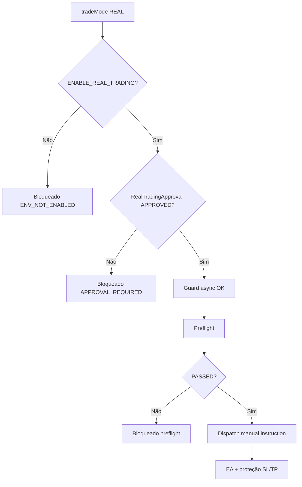

# Fluxo de aprovação manual — conta real controlada

**Status:** `REAL_TRADING_MANUAL_APPROVAL_FLOW_IMPLEMENTED`  
**Branch:** `staging-vps-homologacao`

---

## Princípios

| Regra | Descrição |
|-------|-----------|
| Default deny | REAL bloqueado por padrão |
| Master switch | `ENABLE_REAL_TRADING=true/1` no ambiente — **necessário**, mas **insuficiente** |
| Aprovação manual | `RealTradingApproval` **APPROVED** + `allowReal=true` por licença/conta/símbolo/magic |
| Allowlist env | `REAL_TRADING_ALLOWED_LICENSE_IDS` — **opcional**, não substitui approval |
| Sem liberação global na UI | Painel `/admin/risk/real-trading-guard` é read-only para envs |
| Aprovação ≠ ordem | Criar approval **não** envia ordem nem ativa dispatch automático |
| Preflight obrigatório | Mesmo com approval, exige PRE_MARKET, margem, EA online, etc. |
| Caixa preta | Nenhum parâmetro de estratégia exposto ao cliente |

---

## Camadas do gate

---

## Admin — telas

| Rota | Função |
|------|--------|
| `/admin/risk/real-trading-guard` | Status read-only + links para aprovações |
| `/admin/real-trading/approvals` | Listagem com conta/licença mascaradas |
| `/admin/real-trading/approvals/new` | Formulário com confirmação `AUTORIZO REAL CONTROLADO` |
| `/admin/real-trading/approvals/[id]` | Detalhes, snapshots/preflights/protection, ações |

### Criação de aprovação

Campos obrigatórios: licença, conta, servidor, símbolo, magic (910001–910999), `maxContracts` (padrão 1), `minFreeMargin` > 0, `marginBufferPercent`.

Confirmação textual exata: **`AUTORIZO REAL CONTROLADO`**

### Ações na aprovação

| Ação | Frase de confirmação |
|------|---------------------|
| Suspender | `SUSPENDER REAL` |
| Revogar | `REVOGAR REAL` |
| Bloquear | `BLOQUEAR REAL` |

Todas registram `AdminAction` / audit — **sem delete** silencioso.

---

## Backend

- `lib/risk/real-trading-guard.ts` — sync (env) + `evaluateRealTradingGuardAsync` (approval)
- `lib/risk/real-trading-approval-query.ts` — busca approval ativo
- `lib/risk/real-trade-preflight.ts` — `allowlistOk` = env allowlist **ou** approval manual
- `lib/admin/real-trading-approval.ts` — CRUD admin + auditoria

### Reason codes (amostra)

- `REAL_TRADING_ENV_NOT_ENABLED`
- `REAL_TRADING_APPROVAL_REQUIRED`
- `REAL_TRADING_ALLOWED_BY_MANUAL_APPROVAL`
- `REAL_TRADING_ALLOWED_BY_CONTROLLED_GATE` (preflight PASSED)

---

## O que o cliente **não** pode fazer

- Criar ou alterar `RealTradingApproval` via API pública
- Definir `allowReal` por payload
- Liberar REAL globalmente
- Ativar dispatch automático

---

## Invariantes operacionais

- Dispatch automático: **desativado**
- REAL global: **não** liberado por esta feature
- Estratégia: **caixa preta** preservada
- Secrets: **não** em docs/logs públicos

---

*Mercado da Riqueza AutoTrade — aprovação manual por licença/conta/símbolo/magic.*
